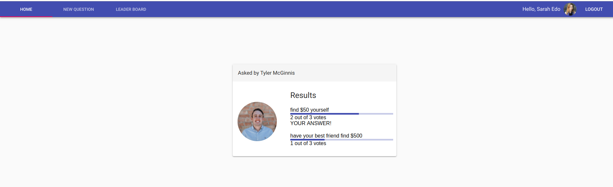

# Would You Rather

This is the second project of [Udacity's React nanodegree](https://www.udacity.com/course/react-nanodegree--nd019). The project rubric is [here](https://review.udacity.com/#!/rubrics/1567/view). 

Tools/Frameworks which I used to build this app:
- React 16
- Redux
- Redux thunk
- React-router-dom
- materialUI ( The app uses material design)
- Jest for testing

Here are some screenshots:

Login  :

Home  :

leaderboard  :

Add Poll  :

Take Poll  :

Results  :

